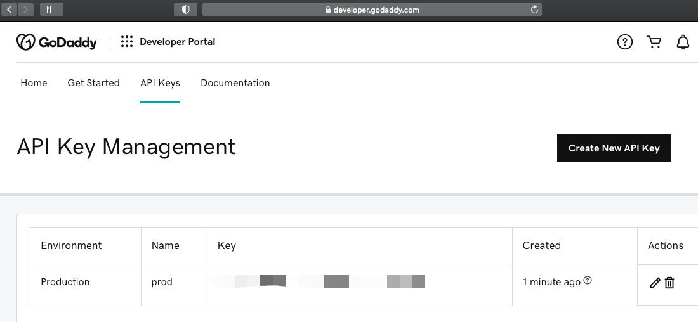

### Installation

```
go install github.com/xujiahua/godaddy-dns@v0.1.0
```


```
$ godaddy-dns
cli for godaddy dns

Usage:
  godaddy-dns [command]

Available Commands:
  completion  generate the autocompletion script for the specified shell
  configure   configure godaddy secret
  ensure      ensure a dns record exist
  help        Help about any command

Flags:
  -h, --help   help for godaddy-dns

Use "godaddy-dns [command] --help" for more information about a command.
```


### Setup: get API Key/Secret

https://developer.godaddy.com/keys




```
$ godaddy-dns configure
? API Key: <type key here>
? API Secret: <type secret here>
OK
```


### Usage

```
$ godaddy-dns ensure -h
ensure a dns record exist

Usage:
  godaddy-dns ensure [flags]

Flags:
      --fqdn string    Fully Qualified Domain Name, e.g., youtube.com, www.youtube.com
  -h, --help           help for ensure
      --type string    A, CNAME (default "A")
      --value string   IP address or CNAME FQDN
```


Make sure you (your GoDaddy account) have access to the domain. For example:

```
$ godaddy-dns ensure --fqdn test2.pdmaker.club --value 192.168.1.1 --type A
keeping: test2.pdmaker.club => 192.168.1.1
```

